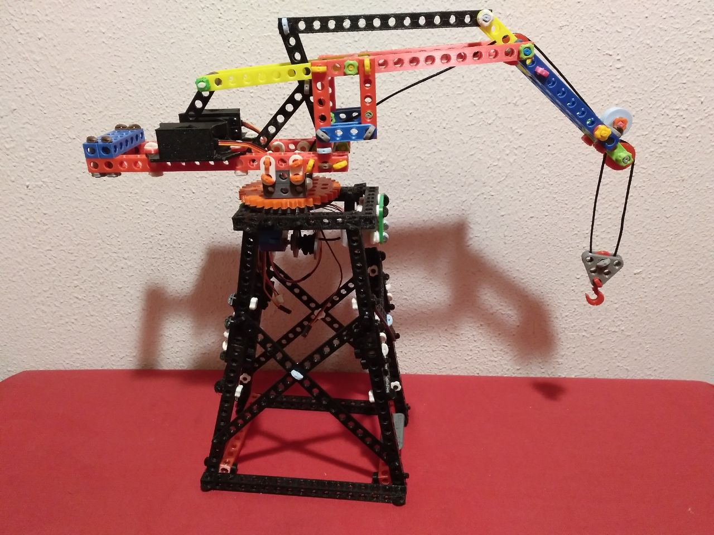
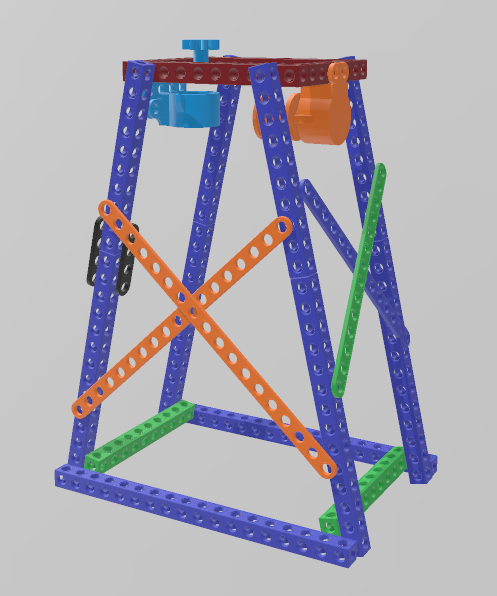
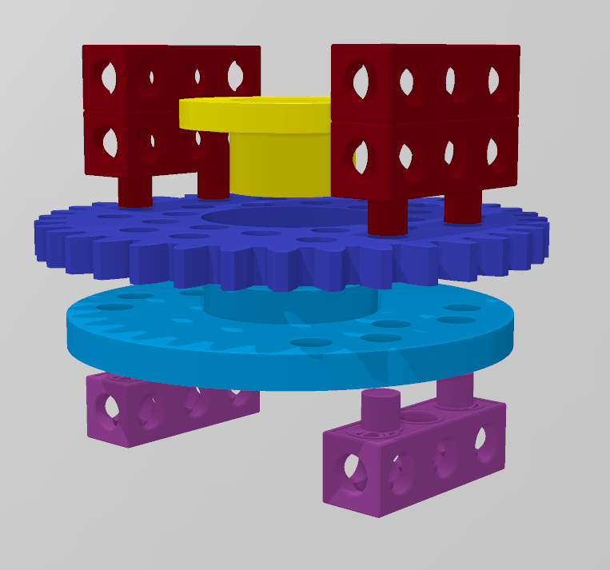
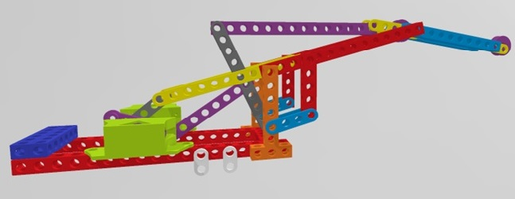

# Grua-Portuaria-Stemfie

Realitzada per [Jordi Mayné](https://github.com/maynej) des de Mechatronic Study 

STEMFIE es un projecte de construcció lliure, que s'imprimeix en 3D (http://stemfie.org) 

Electronics Stemfie es una llibreria STL de suports per tarjes de control, sensors i actuadors amb compatibilitat Stemfie.

[Electronics Suports amb compatibilitat Stemfie](https://github.com/maynej/Electronics-Stemfie), pretén facilitar l'automatització de les construccions amb targes Arduino, Microbit, ESP32 Steamakers... 

La documentació està disponible també en castellà i anglés [en PDF](https://github.com/maynej/Grua-Portuaria-Stemfie/tree/main/DOC)

# Torre base

STL per imprimir la Torre Base [aquí](https://github.com/maynej/Grua-Portuaria-Stemfie/tree/main/STL/Base)

# Plataforma giratòria

STL per imprimir la Plataforma Giratòria [aquí](https://github.com/maynej/Grua-Portuaria-Stemfie/tree/main/STL/PlataformaGiratoria)

# Ploma

STL per imprimir la Ploma articulada [aquí](https://github.com/maynej/Grua-Portuaria-Stemfie/tree/main/STL/Pluma)

## Mesurador Stemfie 

Descripció    | Opcional     | Arxiu         
------------- | ------------ | ----- 
Mesurador Cargols | 1  | [Mesurador](STL/Base/MesuraStemfie2.stl)

## Llicència

Creative Commons Attribution-NoComercial-ShareAlike 4.0 International (CC BY-NC-SA 4.0)    
